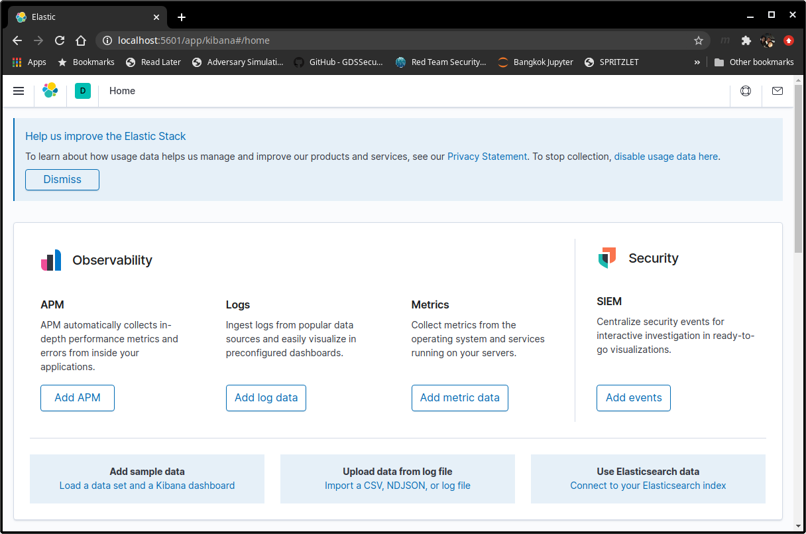
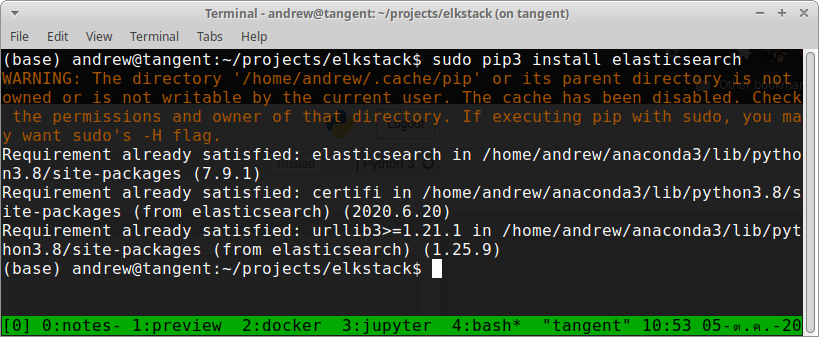
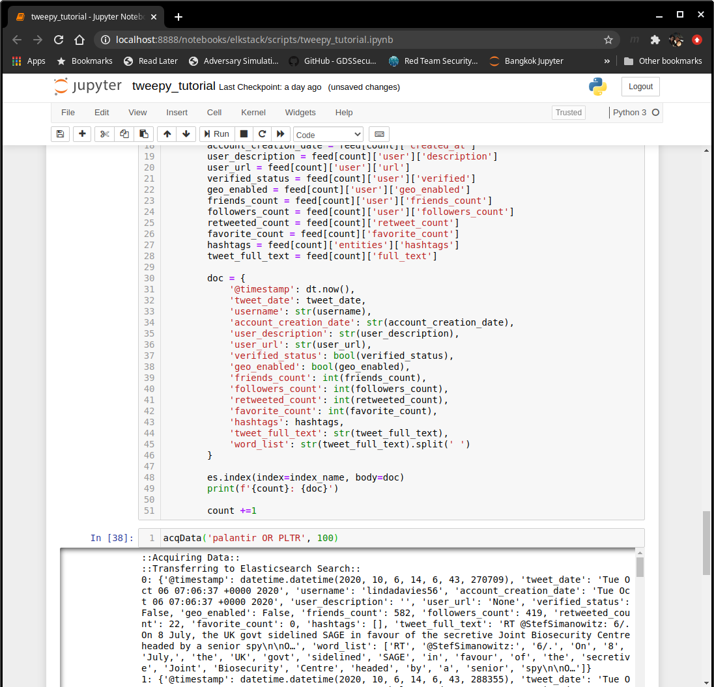
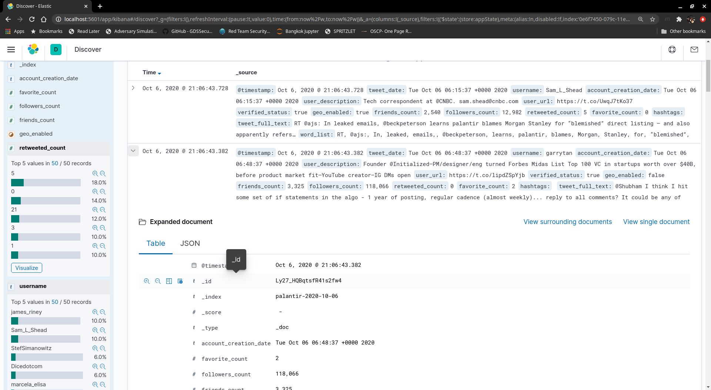

# Open Source Intelligence with Elasticsearch: Analyzing Twitter Feeds 1/3
> Author: Andrew Eng | Updated: 2020-10-05 | Part 1 of 3

## Introduction
This is a three part series in open source intelligence with Elasticsearch.

In part 1: We will look at data acquisition and building a python script to acquire, clean, and transfer data.

In part 2: We will look at building visualizations and dashboards in Kibana and Elasticsearch.

In Part 3: We will look at operationalizing the script into sustainment.

## Start with Why
I had an opportunity to interview with a large tech company but I didn’t know much about them (I’ve been oblivious to what’s popping up in Silicon Valley). Following due diligence and better prepare for the interview, I spent the weekend working on script to help me better understand the general sentiments and what the company was about. At that point in time, any news is new news, and I wanted to consume it.

Twitter is a great social networking platform that delivers almost real-time news generated and posted by “regular people”. It’s great, because it’s really unfiltered and you’re able to somewhat grasp what people are thinking. **The goal of this project is to build a twitter scrapper, dump it into Elasticsearch and create visualization dashboards using Kibana**.

Like most people, I’m a visual person. I love looking at dashboards, graphs, and pictures that makes sense of data. It helps me comprehend and gain insight in a particular subject. I’m also a project based learner. I learn better when I have an end goal. In this case, I’m learning: Python, Elasticsearch, and Kibana. I’m also learning how to use the Twitter API for other projects that I’m working on like Natural Language Processing (Sentiment Analysis, bots, docker, etc.)

### Visualizations: What questions are we trying to answer?
My main focus is to collect as much information about my search as possible. I’d like to track trending tweets, stories, and what people are generally thinking about the subject. With this, I can probably track “influencers. I’m interested in the social impact on how influencers influence. My initial questions to answer are:

1. What are the most retweets of the specific search term? (Tracking topic popularity)
2. How many unique users are tweeting about a given search term? (Is it trending?)
3. What other tweets are they posting about the search term? (Are they a troll / bot?)
4. How many likes does the person have on the search term? (Trending / Sentiments)?

## My Environment
It really doesn’t matter what I’m using, because the processing is low overhead. It’s not processing intensive calculations or stitching anything together. It’s simple: grab tweets, format it into JSON or dictionary, and send it off to Elasticsearch. For this environment, I’ll be using docker to quickly stand-up an Elasticsearch and Kibana (ELKSTACK) so I can focus on the coding parts.

### Docker

<code>$ git clone https://github.com/andreweng/elkstack.git</code>

<code>$ cd elkstack</code>

<code>$ cd docker-compose up</code>


Afterwards, test you have ELKSTACK up and running by browsing to: **[http://localhost:5601](http://localhost:5601)**



### Python
For my twitter scrapper, I’ll be using python 3.8.3 and my IDE will be Jupyter Notebook. Jupyter Notebook is a great Integrated Development Environment that allows you to write code in blocks and run it individually within a web browser. It’s easy to initiate and secure enough to get the job done and tear it down. By default, Jupyter will create open port 8888 on localhost (127.0.0.1) with unique tokens every time you initiate it.

<code>$ cd ~/elkstack/scripts</code>

<code>$ jupyter-notebook</code>


The command above is run on a terminal window while inside the elkstack/scripts folder.

## Coding
### Twitter API
Since we are going to programmatically access twitter and pull records, we’ll need to use the Twitter API. You can grab your APIs following the Twitter API link [https://developer.twitter.com/en](https://developer.twitter.com/en)

#### Authentication
There are 3 types of authentication mechanisms we can use, however basic authentication is deprecated for awhile now:

- **OAuth 1.0a is a method used to make API requests on behalf of a Twitter Account. In other words, application-user authentication.**
- OAuth 2.0 Bearer Token is a authenticates requests on behalf of your developer App. Specifically, it allows your app to pull records in READ-ONLY. In other words, application authentication.
- Basic Authentication accesses twitter as you, it’s basic authentication where you pass your email and password to the app [no longer in use].

For this use-case, I’ll be using the **OAuth 1.0a**, this is mainly so I can access a full range of APIs for later scalability.


### Python Modules

**Quick install of modules:**

<code>$ sudo pip3 install -r requirements.txt</code>

Let's take a look at what modules we are using.  If you used requirements.txt to install the modules, you don't need to run the below commands.

**External modules:**

[Tweepy](https://github.com/tweepy/tweepy) **|** [Documentation](http://docs.tweepy.org/en/latest/index.html)  

I created a notebook that I used to take notes and play around with the module [Tweepy_tutorial](tweepy_tutorial.ipy)

[Elasticsearch](https://github.com/elastic/elasticsearch-py) **|** [Documentation](https://elasticsearch-py.readthedocs.io/en/master/)

**Built in modules:**

[json Documentation](https://docs.python.org/3/library/json.html)

[datetime Documentation](https://docs.python.org/3/library/datetime.html)

<code>$ sudo pip3 install tweepy elasticsearch</code>




### Execute
Import the modules we be using

```python
import tweepy as tw
from datetime import datetime as dt
from elasticsearch import Elasticsearch
```

Generally, it's not a good idea to include credentials and access tokens in scripts.  There's additional security stuff we can explore when we operationalize the script, but for now, let's get this up and running.  Create your API credentials text file and name it twitter.keys. My twitter.keys file looks like:

```text
(base) andrew@tangent:~$ cat twitter.keys 
api_key = <redacted>
api_secret_key = <redacted>
access_token = <redacted>
access_token_secret = <redacted>
(base) andrew@tangent:~$ 

```

Import keys into the script

```python
# Import keys from a saved file instead of inputting it directly into the script
key_location = "/home/andrew/twitter.keys"
apikeys = []
with open(key_location) as keys:
    for i in keys:
            apikeys.append(i.split("=")[1].strip(" ").strip("\n"))
            keys.close()
```

Pass the key information to the script and set server configurations

```python
# Initialize dictionary
twitter_cred = dict()

# Enter API keys
twitter_cred["CONSUMER_KEY"] = apikeys[0]
twitter_cred["CONSUMER_SECRET"] = apikeys[1]

# Access Tokens
twitter_cred["ACCESS_KEY"] = apikeys[2]
twitter_cred["ACCESS_SECRET"] = apikeys[3]

auth = tw.OAuthHandler(twitter_cred["CONSUMER_KEY"], twitter_cred["CONSUMER_SECRET"])

auth.set_access_token(twitter_cred["ACCESS_KEY"], twitter_cred["ACCESS_SECRET"])

api = tw.API(auth, wait_on_rate_limit=True)

# Initialize elasticsearch node
es = Elasticsearch('127.0.0.1', port=9200)
```

**Hello World!** Let’s test our API to see if our authentication is working
```python
public_tweets = api.home_timeline()
for tweet in public_tweets:
    print(tweet.text)
```

```text
RT @TrustlessState: Ethereum vs Moloch

Listen in to @BanklessHQ Pod tomorrow https://t.co/EYd6siXGCC
Cognitive/Artificial Intelligence Systems Market 2020 | Know the Latest COVID19 Impact Analysis .... #industry40… https://t.co/XfleZNyqbi
Follow our @CertifyGIAC blog for news, career advice and insights!

Keep your career on the right track during the… https://t.co/g8sv0UmTr0
[Course Video] 64-bit Assembly Language &amp; Shellcoding: HelloWorld Shellcode JMP-CALL-POP Technique… https://t.co/EcylCvIJA3
Part 2 of the fireside chat between @omgnetworkhq and @curvegrid that’s for the ages! Kick back and learn everythin… https://t.co/230t6aNzsf
It’s technical, but it’s worth it! Learn what Javascripts were used to build the @reddit Community Points Engine an… https://t.co/Qn5fA87bkP
"The growth of the #Bitcoin network, meaning the number of active users and transactions, has stalled in the near t… https://t.co/kodFzWlXaO
Times of India @timesofindia: AI: A force for social empowerment. #AI #ArtificialIntelligence #dataresponsible https://t.co/be9GomEByy
RAISE 2020: PM Narendra Modi to Inaugurate Mega Virtual Summit on Artificial Intelligence Today .... #aistrategy… https://t.co/F2ZuRkPZHO
With verbose logging on all machines and ELK installation, our GCB Cyber Range is equally useful for Red and Blue t… https://t.co/7ZyTIXj76B
Familiarise yourself with windows process fundamentals and learn how to enumerate processes and perform code inject… https://t.co/nvxqfTeeZo
#BinanceFutures Leaderboard Update:

🔸 Add your Twitter account

🔸 Extended to top 500

🔸 Filter by sharing positio… https://t.co/dk4UzLK1K3
Google delays mandating Play Store’s 30% cut in India to April 2022; Paytm launches mini app store.… https://t.co/tACcbTSAjl
The best summary of crypto market structure's rapid evolution and the implications for different players. A must re… https://t.co/oyJa4LxsfQ
RT @JATayler: Oh my god https://t.co/Uh6dvfvLmJ
RT @Casey: so perfect.. if only we’d started with these everyone would be wearing a mask.
While Darknet Users Search for New Markets, Global Law Enforcement Reveals Mass Arrests https://t.co/NadzkEh06s https://t.co/VIFKNxc6mZ
[Course Video] Reconnaissance for Red-Blue Teams: Memcache Servers Part 5: Advanced Enumeration: LRU CRAWLER… https://t.co/uiugVKAP5n
Do you really want to work with Justin Sun? Apply here: https://t.co/GKNOmX2ykp https://t.co/vGAunnlYO4
RT @seibelj: On Poloniex and Working With Justin Sun https://t.co/M3lAFyiDQQ @Poloniex @justinsuntron"
```

Data acquisition function: Takes 2 arguments; 
- search = what to search for, 
- acq = how many tweets to grab

> usage: acqData('palantir','100')

There’s a lot of metadata in each tweet. I am only extracting ones that I care about. In actuality, it might be better to collect everything and perform post processing after it hits Elasticsearch.

```python
def acqData(search, acq):

    # Create an index name using our search criteria and today's date
    index_name = search.split(' ')[0] + '-' + dt.today().strftime('%Y-%m-%d')

    # Initialize the feed list of dictionaries
    feed = []
    
    print('::Acquiring Data::')
   
    # Data Acquisition
    for i in tqdm(range(acq)):
        for tweet in tw.Cursor(api.search, q=search, tweet_mode='extended').items(acq):
            feed.append(tweet._json)

    # Formatting the data and extracting what we need
    count = 0
    
    print('::Transferring to Elasticsearch Search::')
    
    while count < len(feed):
        for i in tqdm(range(acq)):

            # Created variables instead of directly injecting it to the dictionary because it's easier to read
            tweet_date = feed[count]['created_at']
            username = feed[count]['user']['screen_name']
            account_creation_date = feed[count]['created_at']
            user_description = feed[count]['user']['description']
            user_url = feed[count]['user']['url']
            verified_status = feed[count]['user']['verified']
            geo_enabled = feed[count]['user']['geo_enabled']
            friends_count = feed[count]['user']['friends_count']
            followers_count = feed[count]['user']['followers_count']
            retweeted_count = feed[count]['retweet_count']
            favorite_count = feed[count]['favorite_count']
            hashtags = feed[count]['entities']['hashtags']
            tweet_full_text = feed[count]['full_text']

            # Prepare data for elasticsearch
            doc = {
                '@timestamp': dt.now(),
                'tweet_date': tweet_date,
                'username': str(username),
                'account_creation_date': str(account_creation_date),
                'user_description': str(user_description),
                'user_url': str(user_url),
                'verified_status': bool(verified_status),
                'geo_enabled': bool(geo_enabled),
                'friends_count': int(friends_count),
                'followers_count': int(followers_count),
                'retweeted_count': int(retweeted_count),
                'favorite_count': int(favorite_count),
                'hashtags': hashtags,
                'tweet_full_text': str(tweet_full_text),
                'word_list': str(tweet_full_text).split(' ')
            }

            # Import into elasticsearch using the generated index name at the top of the function <search> + <date>
            es.index(index=index_name, body=doc)

            count +=1
```

In the below code, we are calling the acqData function and passing the arguments ‘palantir OR PLTR’ and 100. I am looking for any keyword matches for “palantir OR PLTR” and I want to grab 100 most recent tweets.

```python
# Main Function; Let's run this function!
acqData('palantir OR PLTR', 100)
```



We now have the data in the format we want and it imported into Elasticsearch using the es.index method in our acqData function. Let’s check Kibana.



## Part 1 Conclusion:
Part 1 of this series focuses on data acquisition and using python along with 2 modules: Tweepy and Elasticsearch. We used Tweepy as programmatic interface to Twitter and then used Elasticsearch to inject tweets into the database. Looking at Kibana, it already has some really useful information:

- Percentage of usernames that tweeted about the topic in the 2500 tweet download
- Percentage of retweets found in the 2500 tweet download

In Part 2, we’ll explore the data a little bit more and try to answer some of the questions that we initially came up with. We’ll create dashboards and visualizations and explore what else we can extract from the information we got.